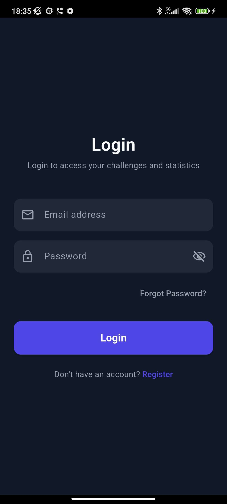
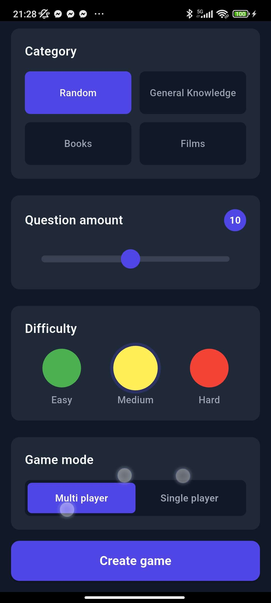
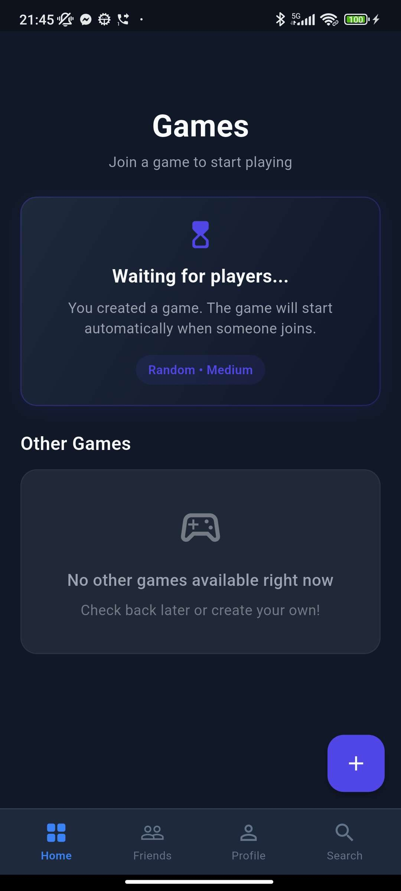
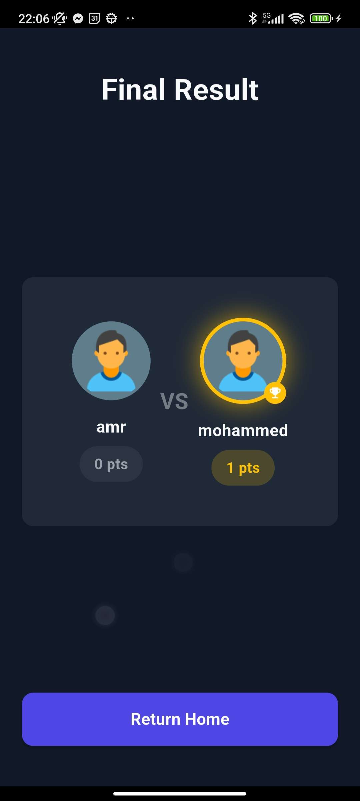
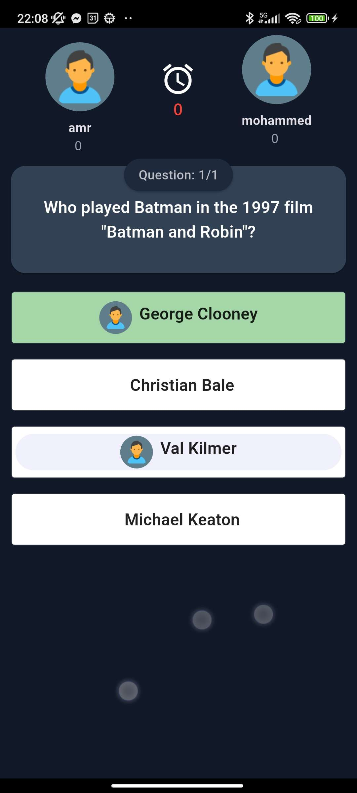
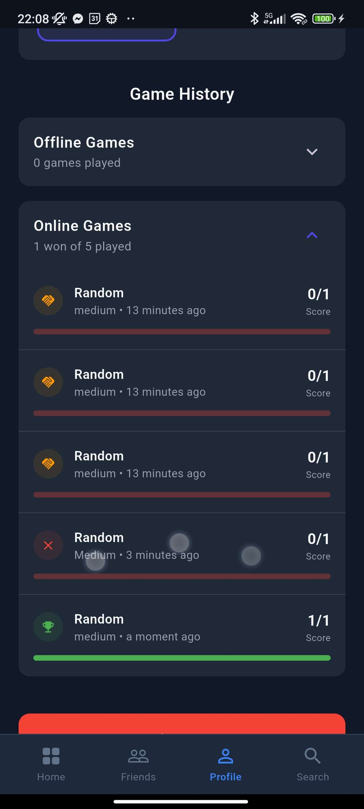
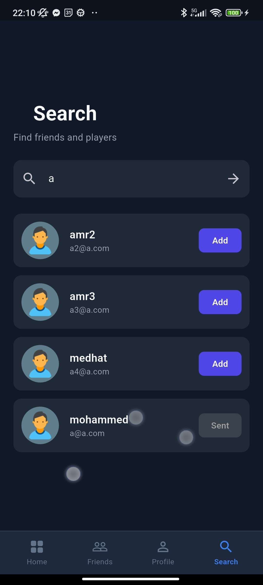

# Realtime Quizzes

Challenge other players in realtime quizzes! This Flutter application allows users to compete in online games against other players and offline games, manage friends, and track their progress.

## App Preview

|   |   |   |
|---|---|---|
|  |  |  |
|  |  |  |
|  |  | |

## Features

- **Authentication**: Secure Login, Registration, and Password Reset functionality.
- **Realtime Multiplayer**: Create games and challenge friends or other users in real-time.
- **Single Player Mode**: Practice and test your knowledge with single-player quizzes.
- **Friends System**: Search for users, send friend requests, and manage your friends list.
- **Profile Management**: View and update your profile.
- **Leaderboards & Results**: Track your scores and compare with others.

## Tech Stack

- **Framework**: [Flutter](https://flutter.dev/)
- **State Management**: [GetX](https://pub.dev/packages/get)
- **Backend**: Firebase (Auth, Firestore, Storage)
- **Networking**: Dio
- **UI Components**: 
  - Syncfusion Flutter Sliders
  - Shimmer
  - Flutter SVG
  - Badges

## Getting Started

1.  **Clone the repository:**
    ```bash
    git clone https://github.com/yourusername/realtime_quizzes.git
    ```

2.  **Install dependencies:**
    ```bash
    flutter pub get
    ```

3.  **Environment Configuration:**
    - Create a `.env` file in the root directory with your API keys:
      ```
      TRIVIA_API_KEY=your_api_key_here
      ```

4.  **Firebase Setup:**
    - Ensure you have a `google-services.json` file in `android/app/` for Android.
    - Ensure you have a `GoogleService-Info.plist` in `ios/Runner/` for iOS.

5.  **Run the app:**
    ```bash
    flutter run
    ```
